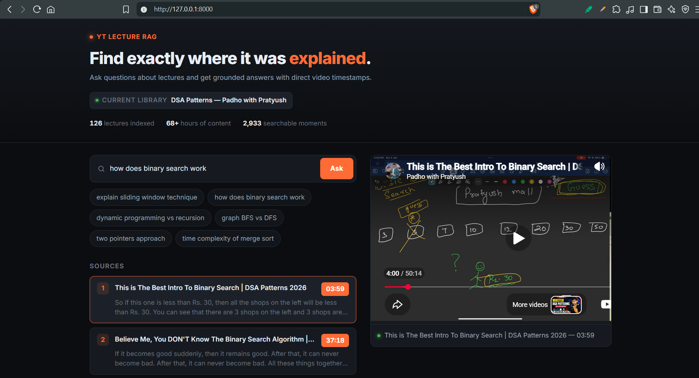

# YouTube Lecture RAG

A timestamp-aware **Retrieval-Augmented Generation (RAG)** system for asking questions about long-form YouTube lectures and getting **grounded answers with clickable video timestamps**.

The current implementation is demonstrated on a DSA lecture playlist, but the underlying architecture is designed to be reusable for other educational and technical video collections.

---

## Demo



Ask questions about lectures, retrieve the most relevant explanations, and jump directly to the exact moment where the concept was discussed.

---

## Why This Project?

Long-form educational videos contain a huge amount of useful information, but finding one specific explanation can require manually searching through an entire lecture or playlist.

Traditional RAG systems usually work with documents:

```text
Question
   ↓
Retrieve Relevant Text
   ↓
Generate Answer
````

For video-based learning, the location of the information is equally important.

YouTube Lecture RAG extends this workflow:

```text
Question
   ↓
Retrieve Relevant Lecture Segment
   ↓
Preserve Video + Timestamp
   ↓
Generate Grounded Answer
   ↓
Answer + Source Timestamp
   ↓
Jump Directly to Video
```

Instead of only answering **"What is the answer?"**, the system also answers **"Where in the lecture can I find it?"**

---

## How It Works

```text
                    YouTube Playlist
                           │
                           ▼
                         yt-dlp
                           │
                           ▼
                  Whisper Transcription
                           │
                           ▼
              Timestamped Transcript Segments
                           │
                           ▼
                 Time-Aware Chunking
                           │
                           ▼
                     Embeddings
                           │
                           ▼
                  Qdrant Vector Database
                           │
                           ▼
                   Semantic Retrieval
                           │
                           ▼
                Relevance / Grounding Check
                           │
                           ▼
                       Groq LLM
                           │
                           ▼
              Answer + Timestamp Citations
                           │
                           ▼
                  YouTube IFrame Player
```

Each transcript segment retains its relationship with the original video and its timestamp.

This allows retrieved chunks to be mapped back to the exact location where the information was explained.

---

## Features

* 🎥 YouTube playlist ingestion
* 🎙️ Whisper-based transcription
* ⏱️ Timestamp-aware transcript chunking
* 🔎 Semantic search using vector embeddings
* 🗄️ Qdrant vector database
* 🤖 Grounded LLM-generated answers
* 📍 Clickable timestamp citations
* ▶️ Direct navigation inside the YouTube player
* 🛑 Grounding checks and refusal for unsupported queries
* 💾 Cached transcripts
* 🔁 Idempotent indexing
* 🌐 FastAPI web interface
* 💻 CLI for ingestion, search, indexing, and evaluation
* 📊 Golden-set retrieval evaluation

---

## Tech Stack

| Component       | Technology                |
| --------------- | ------------------------- |
| Video ingestion | yt-dlp                    |
| Transcription   | faster-whisper            |
| Embeddings      | sentence-transformers     |
| Vector database | Qdrant                    |
| LLM             | Groq                      |
| Backend         | FastAPI                   |
| CLI             | Typer + Rich              |
| Frontend        | HTML + YouTube IFrame API |
| Environment     | Python 3.11 + uv          |

---

# Getting Started

## Requirements

* Python 3.11
* [uv](https://docs.astral.sh/uv/)
* Groq API key
* Qdrant Cloud instance and API key
* Internet connection

For ingesting and transcribing large playlists, a capable machine/GPU is recommended.

---

## 1. Clone the Repository

```bash
git clone https://github.com/IshikaS2006/youtube-lecture-rag.git
cd youtube-lecture-rag
```

---

## 2. Create the Environment

```bash
uv venv --python 3.11
```

On Windows:

```powershell
.venv\Scripts\Activate.ps1
```

Install dependencies:

```bash
uv sync
```

---

## 3. Configure Environment Variables

Create a `.env` file in the project root:

```env
GROQ_API_KEY=your_groq_api_key
QDRANT_URL=your_qdrant_url
QDRANT_API_KEY=your_qdrant_api_key
```

> **Important:** Never commit `.env` or expose your API keys publicly.

---

# Using the Existing Corpus

The repository currently contains a DSA lecture corpus that can be indexed and queried.

## Rebuild the Vector Index

```bash
uv run ytrag reindex
```

## Ask a Question

```bash
uv run ytrag ask "memoization aur tabulation ka difference kya hai?"
```

The system retrieves relevant lecture segments and generates an answer using the retrieved context.

## Search the Corpus

```bash
uv run ytrag search "binary search"
```

This allows you to inspect retrieval results without generating a complete answer.

## Start the Web Interface

```bash
uv run ytrag serve
```

Open:

```text
http://127.0.0.1:8000
```

The web interface provides:

* Natural-language search
* Grounded answers
* Source citations
* Video titles
* Timestamps
* Embedded YouTube playback
* Direct timestamp navigation

---

# Ingest Your Own YouTube Playlist

The architecture is not tied to a single playlist.

You can ingest another educational or technical YouTube playlist using the same pipeline.

## 1. Preflight Check

```bash
uv run ytrag preflight --playlist "<PLAYLIST_URL>"
```

## 2. Test With One Video

```bash
uv run ytrag ingest --playlist "<PLAYLIST_URL>" --limit 1
```

This helps verify video access, transcription, and chunking before processing the complete playlist.

## 3. Ingest the Complete Playlist

```bash
uv run ytrag ingest --playlist "<PLAYLIST_URL>"
```

The pipeline performs:

```text
Playlist Discovery
       ↓
Video Download
       ↓
Audio Processing
       ↓
Whisper Transcription
       ↓
Transcript Caching
       ↓
Timestamp-Aware Chunking
       ↓
Embedding Generation
       ↓
Qdrant Indexing
```

## 4. Rebuild the Retrieval Index

```bash
uv run ytrag reindex
```

Cached transcripts allow the downstream indexing pipeline to be rebuilt without repeating transcription.

---

# Timestamp-Aware Retrieval

The main difference between this project and a basic document RAG system is that the system preserves the **temporal position** of retrieved information.

A transcript segment contains information such as:

```text
Video ID
Start Time
End Time
Transcript Text
```

For example:

```text
Video: Dynamic Programming
Start: 12:04
End: 13:16

"Memoization stores previously calculated subproblems..."
```

When this segment is retrieved, its timestamp remains attached to the result.

The frontend can then use that timestamp to navigate the YouTube player directly to the relevant point.

---

# Grounded Generation

The system does not blindly generate an answer for every question.

The retrieval pipeline first determines whether sufficiently relevant information exists in the indexed corpus.

```text
User Query
    │
    ▼
Vector Retrieval
    │
    ▼
Relevance Check
    │
    ├────────────── No ──────────────► Refuse
    │
    ▼
Relevant Context
    │
    ▼
Groq LLM
    │
    ▼
Grounded Answer
    │
    ▼
Timestamp Citations
```

This helps prevent unrelated lecture content from being presented as evidence for an answer.

For questions outside the indexed knowledge, the system can prefer a refusal instead of generating an unsupported response.

---

# Cached Transcripts

Transcription is one of the more expensive stages of processing a large video corpus.

The project therefore separates transcription from downstream retrieval:

```text
Video
  ↓
Transcription
  ↓
Cached Transcript
  ↓
Chunking
  ↓
Embeddings
  ↓
Vector Index
```

Once transcripts are available, you can experiment with:

* Chunk sizes
* Chunk overlap
* Embedding models
* Retrieval parameters
* Index configuration

without needing to transcribe the videos again.

---

# Evaluation

The project includes a retrieval evaluation workflow using a predefined golden set.

Run:

```bash
uv run ytrag eval --verbose
```

The evaluation checks whether expected lecture videos and relevant timestamp regions are retrieved for predefined questions.

A typical evaluation case contains:

```text
Question
Expected Video
Expected Timestamp
Timestamp Tolerance
```

This makes retrieval changes measurable instead of relying only on manual testing.

---

# Project Structure

```text
youtube-lecture-rag/
│
├── api/
│   ├── __init__.py
│   └── main.py
│
├── eval/
│   ├── golden.json
│   └── golden_draft.json
│
├── index/
│
├── transcripts/
│
├── ytrag/
│   ├── __init__.py
│   ├── answer.py
│   ├── chunk.py
│   ├── cli.py
│   ├── config.py
│   ├── embed.py
│   ├── evaluate.py
│   ├── index.py
│   ├── models.py
│   ├── playlist.py
│   ├── transcribe.py
│   └── util.py
│
├── .env.example
├── .gitignore
├── .python-version
├── main.py
├── pyproject.toml
├── README.md
└── uv.lock
```

---

# Current Dataset

The current implementation is demonstrated using a DSA lecture playlist from **Padho with Pratyush**.

This is the current indexed corpus used to demonstrate the system, not a hard-coded limitation of the architecture.

```text
YT Lecture RAG
      │
      └── Current Library
              │
              └── DSA — Padho with Pratyush
```

The same pipeline can be used to build another lecture library by replacing the playlist and running the ingestion workflow.

---

# Design Highlights

## Retrieval and Generation Are Separate

The system first retrieves relevant information and then passes that context to the LLM.

```text
Query
  ↓
Retrieval
  ↓
Relevant Context
  ↓
LLM
  ↓
Answer
```

This makes the retrieval layer independently testable.

## Video Location Is Part of the Retrieval Result

The system does not treat timestamps as an afterthought.

A retrieved result contains both:

```text
Semantic Information
        +
Temporal Information
```

This is what enables direct navigation to the source lecture.

## Reproducible Indexing

The ingestion and indexing stages are separated so that the system can be re-indexed without repeating expensive transcription work.

This also makes it easier to experiment with different retrieval configurations.

---

# Useful Commands

```bash
# Check a playlist
uv run ytrag preflight --playlist "<PLAYLIST_URL>"

# Ingest one video
uv run ytrag ingest --playlist "<PLAYLIST_URL>" --limit 1

# Ingest a complete playlist
uv run ytrag ingest --playlist "<PLAYLIST_URL>"

# Rebuild the index
uv run ytrag reindex

# Ask a question
uv run ytrag ask "your question"

# Search the corpus
uv run ytrag search "your query"

# Run evaluation
uv run ytrag eval --verbose

# Start the web interface
uv run ytrag serve
```

---

# Limitations

* Retrieval quality depends on transcription quality.
* Technical terminology may occasionally be transcribed incorrectly.
* Chunking and embedding choices affect retrieval quality.
* The system can only reliably answer questions supported by the indexed corpus.
* YouTube availability can affect video ingestion.
* External LLM and vector database providers may impose rate or usage limits.
* The current application is primarily designed as a project/demo system rather than a large multi-tenant production service.

---

# Future Improvements

* Multi-playlist and multi-course libraries
* Metadata-based filtering
* Hybrid lexical + semantic retrieval
* Reranking models
* Background ingestion jobs
* Distributed transcription
* Larger retrieval evaluation datasets
* User-specific lecture libraries
* Authentication and access control
* Production monitoring
* Scalable deployment

---

# Why This Project?

Most RAG systems answer:

> **"What is the answer?"**

YouTube Lecture RAG also answers:

> **"Where in the lecture can I find it?"**

By combining semantic retrieval, grounded generation, and timestamp-aware citations, long-form video content becomes **searchable, verifiable, and directly actionable**.

---

# License

This project is licensed under the **MIT License**.

See the [`LICENSE`](LICENSE) file for details.

---

# Author

**Ishika Singh**

GitHub: [@IshikaS2006](https://github.com/IshikaS2006)

---

⭐ If you find this project useful, consider giving it a star.

